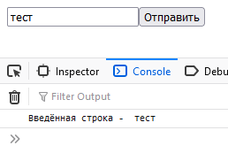
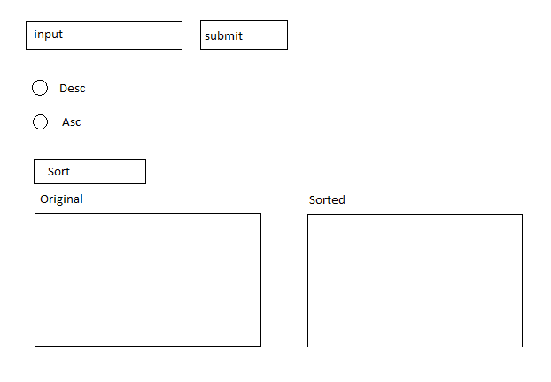

# Упражнения на понимание базовых вещей в front-end

## Упражнение 1

Чтобы начать делать упражнения в более простой и понятной форме требуется разработать первоначальное окно. Окно будет простейшим, без стилей, которое должно принимать на вход строку через `input` и `button`.

Окно должно работать через нажатие на кнопку и через нажатие на `Enter`.

В результате ввода пользователя и отправки данных строка, написанная в `input` должна отобразиться в консоле.

### Пример упражнения 1

## Упражнение 2

Добавить на прошлую форму новые элементы. Один элемент будет радиокнопкой с двумя вариантами, "по возрастанию" и "по убыванию". Второй элемент будет кнопкой "сортировать".

1. Пользователь вводит в первое текстовое поле любое количество слов (по одному, через enter или нажатие на кнопку).
2. Введённые слова отображаются в столбце под кнопкой сортировки.
3. Выбирает один из 2х вариантов сортировки.
4. После этого внизу появляется недоступный для редактирования список отсортированных элементов.

### Пример вида упражнения 2

## Упражнение 3

За основу можно взять первое упражнение. Ниже кнопки "отправить" надо будет добавить элемент множественного выбора (появляется после 2го шага), ещё ниже радиокнопки и кнопку "посчитать".

1. Пользователь вводит через пробел любое количество чисел (через enter или нажатие на кнопку).
2. После этого все числа разбиваются по пробелам и составляется ниже кнопки элемент, в котором можно выбрать от 1 до всех чисел.
3. В радиокнопках должны быть доступны `+`, `-`, `*`, `/`.
4. После нажатия на кнопку "посчитать" над всеми числами из множественного выбора сверху вниз производится выбранное действие.
5. Вывод результата в нередактируемое поле снизу кнопки.

## Упражнение 4

За основу можно взять первое упражнение. Ниже кнопки отправить надо будет добавить 3 поля для отображения и их менять.

1. Пользователь вводит число от 10 до 1000 (это будет N) в форму ввода.
2. Программа генерирует случайно N чисел от 1 до 100.
3. Вывести ниже формы ввода все уникальные числе, среднее арифметическое, самое большое и маленькое.

## Упражнение 5

За основу можно взять первое упражнение. К форме для ввода добавится ещё одно, чуть ниже.  

1. Пользователь вводит произвольное число строк в первую форму для ввода (через enter или нажатие на кнопку).
2. Пользователь вводит количество групп во второую форму для ввода.
3. Вывести случайно разбитые на нужное количество групп строки. Примерно одинаково количество строк в группах. Для этого сделать динамическое появление нужного количества столбцов внизу страницы с входящими туда строками.

Если будет желание, можно чуть усложнить задачу и сделать, чтобы случайным образом выбиралась название этой группы и добавлялось, как заголовок столбца.
